#  ROAD TO MVP II — Haciendo que funcione (Backend)"

Esta unidad aborda la **transición desde un prototipo frontend hacia un MVP funcional con backend**, enfatizando que un producto real necesita persistencia de datos, reglas compartidas y coordinación entre usuarios. Los temas principales son:

1. **De frontend a sistema completo**: Explica por qué una app que solo responde clicks no es suficiente; necesita backend para coordinación.
2. **Backend como orquestador**: Define el backend como donde vive la lógica, se aplican reglas y se toman decisiones.
3. **Persistencia de datos**: Introducción a bases de datos relacionales y su importancia para que el producto "recuerde".
4. **Supabase como solución para MVP**: Ventajas de usar Supabase (base de datos, autenticación, storage, seguridad integrada).
5. **Autenticación**: Cuándo es necesaria, autenticación progresiva y su rol en la experiencia de usuario.
6. **Seguridad básica**: Control de acceso, RLS (Row Level Security) y por qué no confiar solo en el frontend.
7. **APIs e integraciones externas**: Cómo conectar servicios como email, pagos, storage e IA de forma segura.
8. **IA en productos**: Tipos de uso de IA (prompt único, historial, agentes), dónde ubicarla y cómo gestionar costos y riesgos.
9. **Control de versiones con GitHub**: Flujos de trabajo para mantener el código ordenado y colaborativo.
10. **Deploy y hosting**: Cómo llevar el producto a producción con Vercel y buenas prácticas para entornos reales.

---

# Mapa Conceptual de Temos

```mermaid
graph TD
    A[Unidad 3: Road to MVP II - Backend] --> B1[De Frontend a Sistema]
    A --> B2[Persistencia de Datos]
    A --> B3[Backend con Supabase]
    A --> B4[Autenticación]
    A --> B5[Seguridad y Control de Acceso]
    A --> B6[APIs e Integraciones]
    A --> B7[IA en Productos]
    A --> B8[Control de Versiones]
    A --> B9[Deploy y Hosting]

    B1 --> C1[Lógica en Backend]
    B1 --> C2[Coordinación entre Usuarios]
    B1 --> C3[Estado Compartido]

    B2 --> C4[Bases de Datos Relacionales]
    B2 --> C5[Tablas: Usuarios, Reservas, Estados]
    B2 --> C6[Persistencia vs Memoria Temporal]

    B3 --> C7[Base de Datos PostgreSQL]
    B3 --> C8[Autenticación Integrada]
    B3 --> C9[RLS - Seguridad por Fila]
    B3 --> C10[Alternativas: Firebase, Hasura]

    B4 --> C11[Autenticación Progresiva]
    B4 --> C12[Roles: Admin/Residente]
    B4 --> C13[Cuándo NO usar login]

    B5 --> C14[No confiar en Frontend]
    B5 --> C15[Validación en Backend]
    B5 --> C16[Protección de Datos]

    B6 --> C17[Email, Pagos, Storage]
    B6 --> C18[Variables de Entorno]
    B6 --> C19[Manejo de Errores y Rate Limits]

    B7 --> C20[Tipos de IA: Prompt, Historial, Agentes]
    B7 --> C21[IA en Backend - No en Frontend]
    B7 --> C22[Gestión de Costos y Contexto]

    B8 --> C23[GitHub: Branches, Commits, PRs]
    B8 --> C24[Flujo Individual/Colaborativo]

    B9 --> C25[Vercel para Deploy Rápido]
    B9 --> C26[Entornos: Preview/Producción]
    B9 --> C27[Monitoreo y Rollback]
```

---

# Análisis de tu Prompt y Recomendaciones para Vibe Coding

Tu prompt para la **"App de Gestión de Edificios"** ya está **muy bien estructurado** y cubre aspectos fundamentales de un MVP: CRUD, PWA, Supabase, roles, UI/UX y acceso demo. Sin embargo, basándome en la Unidad 3, hay **capas de robustez y escalabilidad** que puedes agregar **de manera incremental** para transformar tu demo en un producto más real y confiable.

## **Enfoque Incremental Recomendado (por fases)**

### **Fase 1: Base Sólida (Semana 1-2)**
*Ya lo tienes en tu prompt. Implementa exactamente lo que pediste.*

### **Fase 2: Persistencia y Seguridad (Semana 3-4)**
Agregar lo que la Unidad 3 llama **"sistema que coordina"**:

1. **Row Level Security (RLS) en Supabase**  
   - No basta con tener roles en el frontend. Las reglas deben estar en la BD.
   - Ejemplo: Un residente solo puede ver/cancelar SUS reservas.

2. **Validación de reglas de negocio en Backend**  
   - Ejemplo: "No se puede reservar el mismo espacio a la misma hora".
   - Esto debe validarse en Supabase con funciones o triggers, no solo en frontend.

3. **Manejo de errores y logging**  
   - Capturar errores de Supabase y mostrarlos en toasts claros.

### **Fase 3: Integraciones Externas (Semana 5-6)**
Como sugiere la Unidad 3, delegar tareas no core:

1. **Sistema de notificaciones por email**  
   - Confirmación de reserva, recordatorios, anuncios del admin.
   - Integración con Resend o SendGrid.

2. **Backups automáticos de datos**  
   - Configurar backups diarios en Supabase.

3. **Métricas básicas**  
   - Tabla de logs de acciones importantes (quién, qué, cuándo).

### **Fase 4: IA Contextual (Semana 7-8)**
Como se explica en la Unidad 3, la IA debe estar en el backend:

1. **Asistente conversacional para reservas**  
   - "¿Está libre la parrilla el sábado?"
   - La IA interpreta y el backend valida contra la BD.

2. **Generación automática de anuncios**  
   - El admin escribe "recordatorio limpieza piscina" → IA genera mensaje formal.

---

## **Prompts Específicos para Herramientas de Vibe Coding (Firebase Studio AI / Gemini Studio AI)**

### **Prompt 1: Implementar RLS (Row Level Security) en Supabase**
> "Usando el esquema de Supabase que ya tenemos para la app de gestión de edificios, genera las políticas de RLS (Row Level Security) para las tablas `amenities`, `reservations`, `residents` y `announcements`. Reglas:
> - Los residentes solo pueden leer `amenities` y `announcements`.
> - Un residente solo puede crear, leer y actualizar sus propias reservas (`reservations.user_id = auth.uid()`).
> - Los administradores tienen acceso total a todas las tablas.
> - Los anuncios (`announcements`) solo pueden ser creados por administradores.
> Genera el código SQL para aplicar estas políticas y explica cómo activar RLS en cada tabla."

### **Prompt 2: Validación de Reglas de Negocio con Supabase Functions**
> "Crea una función de Supabase (Edge Function o PostgreSQL Function) que valide una nueva reserva antes de insertarla. Debe verificar:
> 1. Que el residente no tenga otra reserva en el mismo horario.
> 2. Que el espacio (`amenity`) esté disponible en ese horario.
> 3. Que se cumpla el tiempo de anticipación configurado por el admin (ej: no reservar el mismo día).
> La función debe recibir `user_id`, `amenity_id`, `start_time`, `end_time` y devolver `{success: boolean, message: string}`.
> Incluye también un trigger que llame a esta función antes de insertar en `reservations`."

### **Prompt 3: Sistema de Notificaciones por Email (Integración Externa)**
> "Implementa un sistema de notificaciones por email para la app de gestión de edificios. Usa Resend (o SendGrid) como servicio externo.
> 1. Crea una tabla `notifications` con: `id`, `user_id`, `type` ('reservation_confirmation', 'reminder', 'announcement'), `subject`, `content`, `sent_at`.
> 2. Crea una Edge Function en Supabase que:
>    - Se dispare cuando se inserta una nueva reserva.
>    - Consulte el email del residente.
>    - Envíe un email de confirmación usando Resend.
>    - Registre la notificación en la tabla.
> 3. Configura variables de entorno en Supabase para las API keys.
> Genera el código completo de la función y las instrucciones para configurar Resend."

### **Prompt 4: Asistente de IA para Reservas (Backend-First)**
> "Implementa un asistente conversacional de IA para la app de reservas, siguiendo el principio 'backend-first' de la Unidad 3.
> 1. Crea una Edge Function en Supabase (`/api/chat`) que:
>    - Reciba `{message: string, user_id: string}`.
>    - Use el SDK de Vercel AI o directamente OpenAI para interpretar la intención.
>    - Ejemplo de prompt: 'Eres un asistente de reservas. El usuario pregunta: {message}. Extrae: amenity_name, fecha, hora. Responde en JSON: `{amenity: string, date: string, time: string}`'.
>    - Valide la disponibilidad consultando la BD.
>    - Devuelva una respuesta natural: 'El {amenity} está libre el {date} a las {time}. ¿Quieres reservarlo?'.
> 2. El frontend solo muestra el chat; toda la lógica y la API key de OpenAI están protegidas en el backend.
> Incluye manejo de errores y rate limiting básico."

### **Prompt 5: Dashboard de Métricas para Admin**
> "Amplía el dashboard del administrador con métricas básicas:
> 1. Crea una nueva vista `reservation_metrics` en Supabase que calcule:
>    - Total de reservas por mes.
>    - Amenity más popular.
>    - Horas pico de uso.
> 2. Agrega una sección en el dashboard del admin con:
>    - Gráfico de reservas por día (usando Chart.js o similar).
>    - Lista de residentes más activos.
>    - Uso por espacio (%). 
> 3. Implementa un sistema de logging de acciones admin: cada vez que cree/edite/elimine un amenity o residente, se registre en una tabla `admin_logs`.
> Diseña una UI limpia con Tailwind para estas métricas."

---

## **Evolucion** de ese MVP hacia un **sistema real** con:

1. **Reglas en el backend, no solo en el frontend**
2. **Seguridad estructural con RLS**
3. **Integraciones externas profesionales** (email, IA, métricas)
4. **IA contextual y segura** (backend-first)

**Observacion Necesaria:**  
Comienza implementando tu prompt tal cual. Luego, **semana a semana**, agrega uno de los prompts adicionales que te sugerí, priorizando según tus necesidades:

1. **RLS** (crítico para seguridad)
2. **Validación de reglas** (evita conflictos)
3. **Email** (mejora experiencia)
4. **IA** (valor diferencial)
5. **Métricas** (toma de decisiones)
